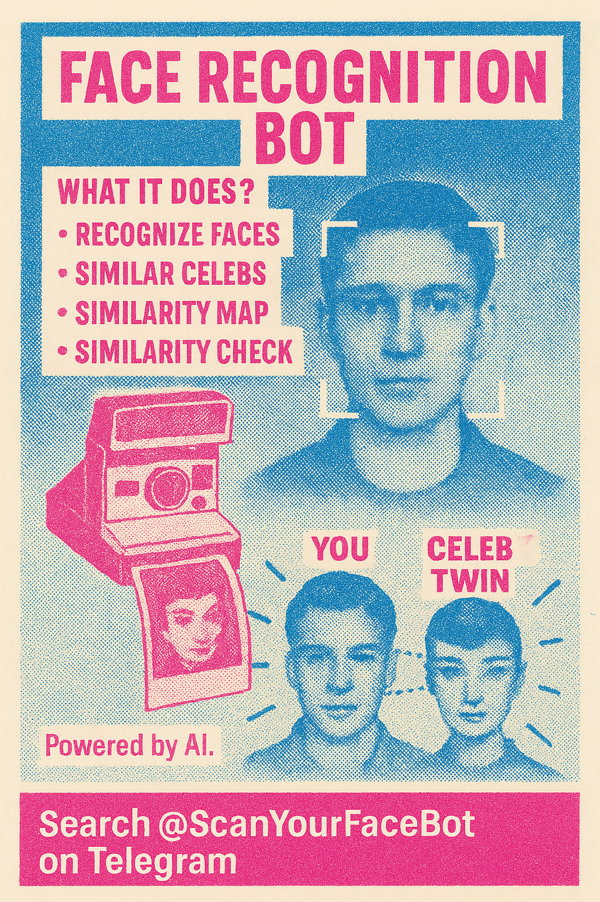

# Telegram Face Recognition Bot 🤖📸

[➡️ Click here to try the bot on Telegram](https://t.me/ScanYourFaceBot)

Welcome to the **Telegram Face Recognition Bot**! This project is part of the *"From Idea to Reality Using AI"* course and combines cutting-edge face recognition technology with a fully interactive Telegram bot.

The bot allows any user to:
- **Add faces** and name them 🧑‍💻
- **Recognize faces** in uploaded photos 📷
- **Reset all known faces** 🔄
- **Find similar celebrities** 🕵️‍♂️⭐
- **Generate a similarity map** of all known and celebrity faces 🗺️
- **Get similarity check for 2 people**👩‍👦

---

## 🚀 Features

| Feature                | Description                                                                                                    |
|------------------------|----------------------------------------------------------------------------------------------------------------|
| **Add Face**           | Upload an image of a single face, name the person, and the bot stores their face encoding.                     |
| **Recognize Faces**    | Upload a photo with one or more faces, and the bot recognizes who appears in the image (if known).             |
| **Reset Faces**        | Clears all previously stored faces and resets the bot's memory.                                                |
| **Similar Celebs**     | Upload a face, and the bot finds the most visually similar celebrity from a pre-loaded celeb database.         |
| **Map**                | Generates a 2D map (using t-SNE) of all known and celebrity faces, showing how similar they are to each other. |
| **Similarity Check**   | Upload 2 images with a single face each, and the bot replies with theie similarity level (0% - 100%)           |

---

## 🛠️ Tech Stack

- **Python**
- **face_recognition**
- **python-telegram-bot**
- **dotenv**
- **scikit-learn (TSNE)**
- **matplotlib (pyplot)**
- **Pillow**
- **Virtual environment**
- **Git & GitHub for version control**

---

## 🔑 How It Works

1️⃣ **Add Face**
- The user sends a photo with a single face.
- The bot asks for the name of the person.
- The face is encoded and saved along with the name and a cropped version of the face image.

2️⃣ **Recognize Faces**
- The user sends an image with faces.
- The bot detects faces and compares them to stored encodings.
- If a match is found (above a set similarity threshold), the name(s) are returned along with the photo, which is annotated with bounding boxes.

3️⃣ **Reset Faces**
- Removes all stored face data, allowing a fresh start.

4️⃣ **Similar Celebs**
- The user uploads a photo with a single face.
- The bot compares it to a library of celebrity faces.
- The most similar celebrity (based on face encodings) is shown along with their photo.

5️⃣ **Map**
- All stored faces (user-added and celebrities) are plotted using t-SNE dimensionality reduction.
- A visual map is generated showing clusters of similar faces.

6️⃣ **Similarity Check**
- The user uploads 2 images, each containing one face.
- Their similarity level is being presented in percentage

---

## 🔒 Security
✅ **NO hardcoded tokens or API keys.**  
Tokens are securely stored in the `.env` file and loaded using `dotenv`.

---

## 🙌 Acknowledgments
This project is part of the From Idea to Reality Using AI course. Thanks to the instructor for guidance and to the open-source community for the incredible libraries that made this possible.

---

## 👤 Author

Made with ❤️ for the **"Idea to Reality" 2025 course.**

GitHub: [@amitfld](https://github.com/amitfld)

LinkdIn: [Amit Feldman](https://www.linkedin.com/in/amit-fld/)

---
